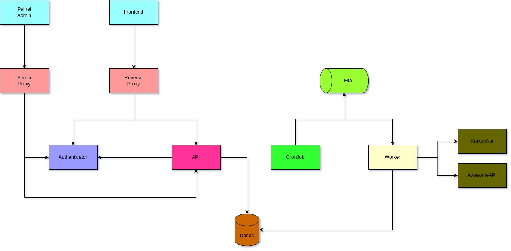

# Seleção FullStack

## Fluxo de processamento

O projeto foi construído utilizando o framework Django Rest Framework e ReactJS. Ele está dividido em 4 serviços: A ```API```, que é responsável por listar as moedas, bem como o histórico de cotações dos dias anteriores; O ```Authenticator``` que é responsável por registrar e gerenciar os usuários logados no sistema; O ```Worker``` foi construído usando o `Celery` e é responsável pela comunicação com os serviços externos para atualizar as cotações das moedas; O ```Frontend``` que é responsável por exibir as infromações. Os serviços se comunicam por meio de API Rest e fila de mensageria (`RabbitMQ`). O banco de dados utilizado para persistir as infomações foi o PostgreSQL.

Basiecamente o ```Frontend``` fará um request para a ```API``` para carregar as informações das moedas salvas bem com do histórico de cotações. A ```Api``` serve apenas para consulta e não faz comunicação com as API's de terceiros para popular a base de dados. Esse serviço é feito no ```Worker``` que periodicamente atualiza os dados do banco com base nas API's externas. O ```Wroker``` é acionado por meio de um CronJob (`Celery Beat`) que periodicamente publica mensagens na fila que o ```Worker```está observando.

Essa arquitetura foi pensada para tornar o projeto escalável e melhor estruturado, já que como existe comunicação com API's de terceiros que podem ser lentas e ficar fora do ar. Caso essa comunicação fosse feita diretamente pela API, a requisição ficaria lenta e com risco iminente de falhar caso a API externa fique fora do ar ou seja muito lenta.

Com o ```Worker``` sendo responsável pela comunicação externa, as requisições para a ```API``` ficam muito mais rápidas e o sitema escalável.

Os fluxos seguem os requisitos mostrados na [especificação do projeto](./README_BASE.md).

O diagrama abaixo mostra a arquitetura do projeto explicada:




## Iniciando o projeto

### Dependências necessárias
Antes de executar o projeto é preciso certificar-se de ter algumas depências instaladas. Elas são: ```Python3.9+``` (e o pip caso não esteja instalado), o ```Docker``` e o ```Docker Compose```.

### Executando o projeto
Depois de instaladas as dependências é possível iniciar o projeto. Para isso execute o seguinte comando:

```shell
make run
```

### Criando tabelas no banco e populando com os dados iniciais
Após certificar-se de ter todas dependências instaladas e o projeto iniciado, é preciso popular o banco de dados com as tabelas que serão utilizadas. Para isso, basta executar na raíz do projeto os comandos:

```shell
make migrate
make fill-quotations
```

OBS: Só é necessário executar esses comandos na primeira vez que em for executar o projeto.


## Executando testes unitários
Para executar os testes unitários é necessário ter as dependências instaladas e o banco de dados construído (já explicado em etapas anteriores). Após isso, basta executar o comando:

```shell
make test
```

## Acessando a interface web
Para acessar a interface web basta acessar a seguinte URL: [http://localhost:8081/](http://localhost:8081/)

OBS:Já existem usuários cadastrados. Eles são: user1@example.com, user2@example.com, user3@example.com e suas senhas são: teste1234.

## Acessando documentação da API
Para acessar a documetação da api, é preciso executar o projeto e acessar a seguinte url: [http://localhost:8081/api/docs/schema/swagger-ui/](http://localhost:8081/api/docs/schema/swagger-ui/) e para acessar a documentação do serviço de autenticação acesse a seguinte url:  [http://localhost:8081/auth/docs/schema/swagger-ui/](http://localhost:8081/auth/docs/schema/swagger-ui/)

## Fluxo principal de uso

Inicialmente deve-se criar um novo usuário no serviço de autencitação na rota `/auth/register` (Já existem 3 usuários registrados, veja observação  no tópico acima). Após isso é preciso gerar o token de autenticação na rota `/auth/api-token-auth/`.
Depois de criado o usuário e gerado token, é possível usar a rota de listagem de moedas (`/api/coin/`) e a rota variação cotações (`/api/quotation/`)

OBS: Todas estas rotas podem ser testadas diretamente nas documentações da API.

## Acessando painel admin
A fim de simular um ambiente de produção real, onde o painel admin é executado em uma url diferente da url da API de modo a gerar maior segurança no sistema, os painels admin dos seviços são executados nas seguintes urls:


[API admin](http://localhost:8082/api/admin/)

[Authenticator admin](http://localhost:8082/auth/admin/)

OBS: Credenciais para acessar o painel admin:
```
username: root
pasword: secret
```

## Lista de comandos

```make migrate```: Inicia o banco de dados PostgreSQL e cria as tabelas necessárias.

```make run```: Inicia todos os serviços do projeto.

```make fill-quotations```: Popula o banco de dados com o histórico de cotações dos ultimos 30 dias.

```make test```: Executa os testes unitários.

```make run-dependecies```: Inicia as dependências do projeto.

```make run-celery```: Inicia o woker Celery e o Celery Beat.

```make logs```: Visualiza os logs dos serviços

```make down```: Encerra a execução dos serviços

```make down-dependecies```: Encerra a execução das dependências

```make down-celery```: Encerra a execução dos workers.

```run-api-local```: Inicia a api fora do ambiente Docker.

```run-authenticator-local```: Inicia o authenticator fora do ambiente Docker.

```run-celery-worker-local```: Inicia o worker fora do ambiente do Docker.

```run-celery-beat-local```: Inicia o Celery Beat fora do ambiente do Docker.

```run-frontend-local```: Inicia o frontend fora do ambiente do Docker.